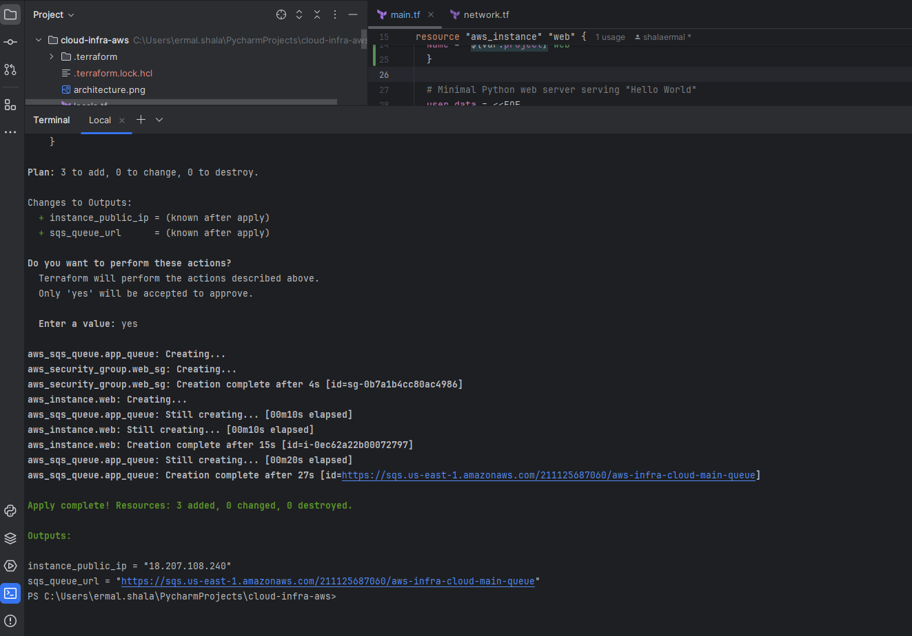
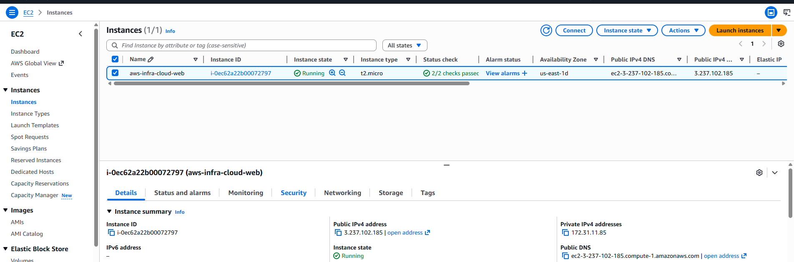
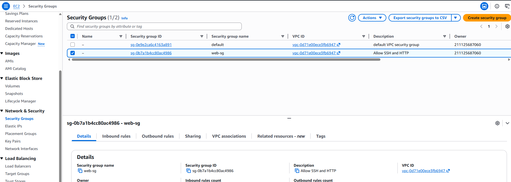
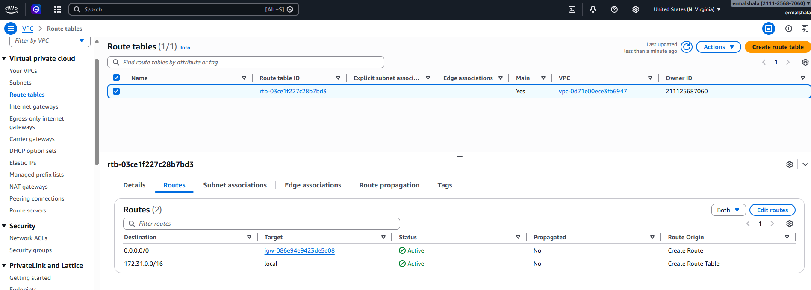
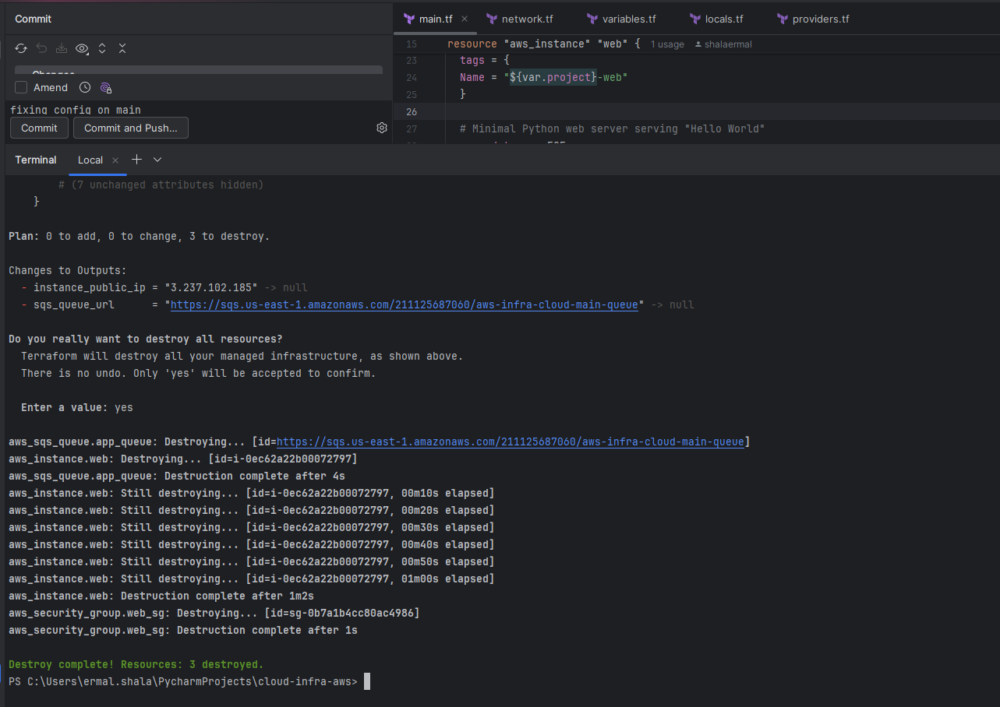

# Cloud Infrastructure on AWS (Terraform)

Provisioning AWS infrastructure using Terraform (Infrastructure as Code).

---

## Overview

This project provisions:

- EC2 instance (Amazon Linux 2023)
- Security Group (SSH + HTTP)
- Default VPC usage
- SQS Queue
- Internet Gateway routing
- Public IP exposure

Infrastructure lifecycle:
provision → validate → destroy

---

## Architecture

Flow:

Internet → Internet Gateway → EC2 (Public Subnet)  
EC2 → Security Group → HTTP (Port 80)

---

## Tech Stack

- Terraform
- AWS EC2
- AWS VPC
- AWS Security Groups
- AWS SQS
- Amazon Linux 2023

---

## Deployment Evidence

### Terraform Apply

Shows successful resource creation:
- EC2 instance
- Security group
- SQS queue
- Public IP output

---

### EC2 Instance Running

Instance state: Running  
Instance type: t2.micro  
Public IP assigned  

---

### Security Group Configuration

Inbound rules:
- 22 (SSH)
- 80 (HTTP)
- 443 (HTTPS)

---

### Route Table (Internet Gateway)

Route:
- `0.0.0.0/0 → Internet Gateway`

---

### Terraform Destroy

All infrastructure successfully destroyed.
