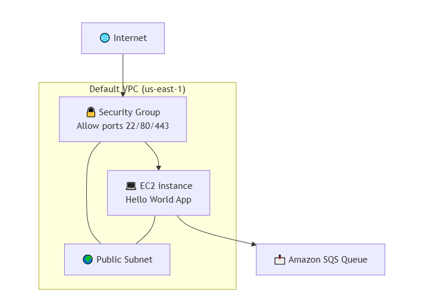

# AWS Cloud Infrastructure with Terraform

This project provisions AWS infrastructure using Terraform.

It creates a production-style environment including:

- VPC
- Public & Private Subnets
- Internet Gateway
- NAT Gateway
- Route Tables
- Security Groups
- EC2 Instance
- SQS Queue

The infrastructure is designed to follow best practices while remaining simple and free-tier friendly.

---

## Architecture Overview

### Infrastructure Diagram



The infrastructure consists of:

### Networking
- Custom VPC
- Public Subnet
- Private Subnet
- Internet Gateway
- NAT Gateway
- Route Tables

### Compute
- EC2 instance deployed inside the VPC

### Messaging
- SQS Queue for decoupled communication

---

## Tech Stack

- Terraform
- AWS VPC
- AWS EC2
- AWS SQS
- AWS IAM

---

## Prerequisites

Make sure you have:

- AWS account
- AWS CLI configured
- Terraform installed

Verify Terraform installation:

```bash
terraform -v
```

---

## Clone Repository

```bash
git clone https://github.com/shalaermal/cloud-infra-aws.git
cd cloud-infra-aws
```

---

## Initialize Terraform

```bash
terraform init
```

---

## Review Execution Plan

```bash
terraform plan
```

---

## Apply Infrastructure

```bash
terraform apply
```

Type `yes` when prompted.

---

## Access the EC2 Instance

After deployment, Terraform will output the public IP of the EC2 instance.

Example:

```bash
curl http://<EC2_PUBLIC_IP>
```

(Replace `<EC2_PUBLIC_IP>` with the output value.)

---

## Destroy Infrastructure

To avoid AWS charges, destroy the infrastructure after testing:

```bash
terraform destroy
```

---

## Design Decisions

- Uses separate public and private subnets
- NAT Gateway allows private subnet outbound access
- SQS used for decoupling
- Infrastructure modular and reusable
- AMI retrieved via AWS SSM Parameter Store

---

## Trade-offs & Assumptions

- Designed for simplicity and learning purposes
- Not production-hardened (no autoscaling, no ALB, no HA setup)
- Focused on infrastructure fundamentals
- Free-tier conscious design

---

## What This Project Demonstrates

- Infrastructure as Code with Terraform
- AWS VPC design
- Public and private networking
- Secure EC2 deployment
- Cloud architecture fundamentals
- Terraform workflow (init → plan → apply → destroy)

---

## Project Status

- Infrastructure deploys successfully
- Networking configured correctly
- EC2 accessible via public IP
- SQS queue created
- Clean teardown supported via `terraform destroy`
